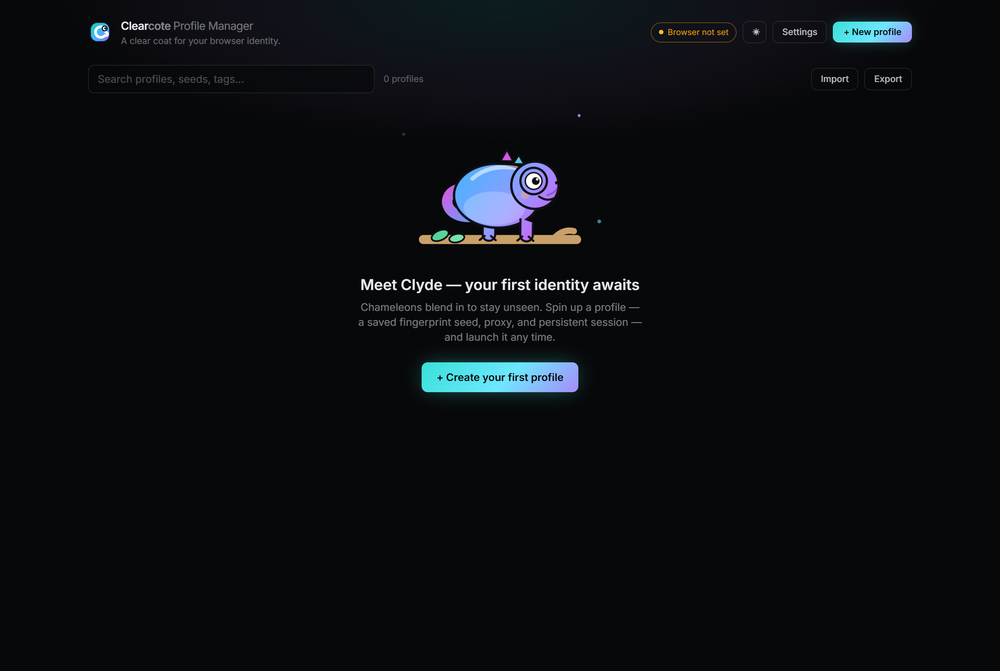
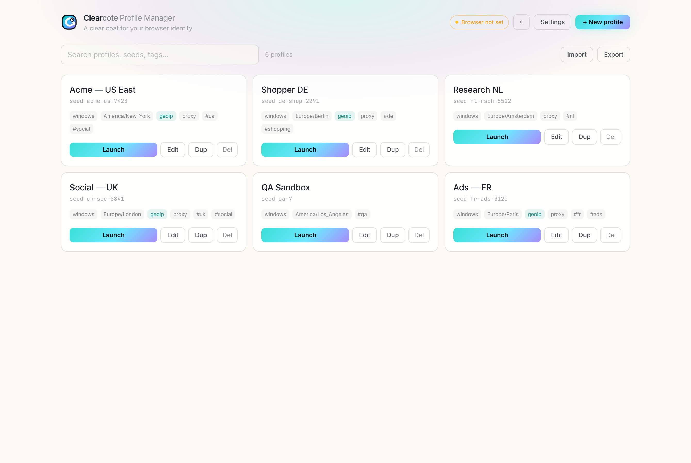

# Clearcote Profile Manager

A desktop app to **create, save, organize, and launch [Clearcote](https://github.com/clearcotelabs/clearcote-browser) browser profiles** — one coherent, persistent identity per profile (fingerprint seed + proxy + persistent storage), opened as a normal interactive browser window you drive yourself.


> **Status:** built — profile create/edit/launch, proxy geo-resolve, import/export, a light/dark theme (dark by default), and a portable Windows build. Full design + phases in **[PLAN.md](PLAN.md)**.

<details>
<summary>More screenshots — meet Clyde, light theme, editor</summary>

**Empty state — meet Clyde, the Clearcote chameleon** (he bobs, blinks, and shifts hue)



**Light theme** (toggle in the header; dark is the default)



**Profile editor**


</details>

## Download

Prebuilt Windows builds are on the **[Releases page](https://github.com/clearcotelabs/clearcote-profile-manager/releases)** — no need to build from source:

- **Installer** — `Clearcote-Profile-Manager-<version>-setup.exe` · double-click to install.
- **Portable** — `Clearcote-Profile-Manager-<version>-x64.zip` · unzip and run `Clearcote Profile Manager.exe` (no install).

### Verify it's genuine (recommended)

Every release is **built entirely by [GitHub Actions](.github/workflows/release.yml)** on a `windows-latest` runner from the tagged commit — not on anyone's machine — so the build is public and auditable. Two independent ways to confirm your download wasn't tampered with:

```bash
# 1. Provenance — cryptographically proves it came from THIS repo's CI at the release commit
gh attestation verify Clearcote-Profile-Manager-<version>-setup.exe -R clearcotelabs/clearcote-profile-manager

# 2. Checksum — SHA256SUMS.txt ships with every release
sha256sum -c SHA256SUMS.txt          # macOS / Linux
# Windows (PowerShell):
# (Get-FileHash .\Clearcote-Profile-Manager-<version>-setup.exe -Algorithm SHA256).Hash
```

> The app is **unsigned**, so Windows SmartScreen may warn on first run (**More info → Run anyway**). Proper Authenticode signing needs a paid certificate; until then, the public-CI build + provenance attestation + checksums are the trust anchor.

## Why

Clearcote is driven by command-line identity flags (`--fingerprint`, `--fingerprint-platform`, `--timezone`, `--accept-lang`, `--webrtc-ip`, `--proxy-server`, `--user-data-dir`). Juggling many identities by hand is tedious and error-prone. This app gives you a GUI to:

- **Create & save profiles** — each a named identity: fingerprint seed, platform/brand, timezone, language, WebRTC IP, geoip auto-match, proxy, notes/tags.
- **Persist sessions** — every profile gets its own `--user-data-dir`, so cookies/logins/storage survive across launches.
- **Launch in one click** — spawns the verified Clearcote binary with the profile's flags as an interactive window.
- **Organize** — search, tag, group, duplicate, import/export.

It reuses the [clearcote npm SDK](https://www.npmjs.com/package/clearcote) only to **resolve + SHA-256-verify** the browser binary (auto-download). Launching is a direct, interactive `chrome.exe` spawn — **not** Playwright automation.

## Stealth options

Beyond the basics, each profile exposes Clearcote's full identity surface (all under **Advanced stealth** in the editor, reflected live in the launch-command preview with secrets redacted):

- **Captured fingerprint** — adopt a *real machine's* GPU, screen, fonts, voices & WebGL via `--fingerprint-profile`. Browse the curated [clearcote-profiles](https://github.com/clearcotelabs/clearcote-profiles) library filtered **by GPU vendor** — pick one matching your host so the imported GPU stays coherent with the actual render.
- **Farbling noise** (on by default) — toggle off (`--disable-fingerprint-noise`) so canvas / WebGL / audio return natural, unperturbed values that read as untampered to strict detectors. Best paired with a captured profile; identity spoofs (UA / screen / GPU / persona) stay on.
- **Use real GPU** (`--disable-gpu-fingerprint`) — report the host's actual GPU instead of a spoofed one; the most coherent option when no matching captured profile is available.
- **Storage quota** (`--fingerprint-storage-quota`, MB) — a realistic `navigator.storage.estimate().quota`; a tiny value reads as incognito / a test machine.
- **GPU vendor / renderer, platform & brand version, hardware concurrency** — fine-grained persona overrides.
- **Mobile (Android) persona** — pick `android` in the **Platform** selector for a best-effort phone identity: mobile UA / UA-CH, touch, mobile viewport (a phone `--window-size` is set automatically), portrait orientation, no PDF plugin, Mali/Adreno GPU.
- **TLS network persona** (`--fingerprint-tls-profile`) — keep the TLS ClientHello coherent with the persona's *claimed* Chrome version instead of always emitting the build's native TLS. `match-persona` (the default) follows the brand version; `native` keeps it stock. Chromium-core (Chrome/Edge/Brave/Opera share the ClientHello).
- **Canvas bridge** *(experimental — `--canvas-bridge-url` + `--canvas-bridge-auth`)* — forward canvas / WebGL rendering to a remote real-GPU host so the pixel readback matches the claimed GPU, for sites that pixel-hash the canvas. Needs a bridge host and a Clearcote build with canvas-bridge support.

> **Tip:** the strongest coherence is a captured profile whose **GPU vendor matches your host** + farbling noise **off**.

## Stack

Electron · Next.js (App Router) · React · TypeScript · Tailwind CSS · packaged with electron-builder (Windows-first, matching the browser).

## Quickstart (once implemented — see PLAN.md Phase 1)

```bash
npm install
npm run dev        # Electron shell + Next.js renderer
npm run dist       # build a Windows installer
```

## Layout

| Path | What |
|---|---|
| `electron/` | main process — profile storage, binary resolution, browser launch, IPC |
| `app/` | Next.js renderer (the UI) |
| `src/types/` | shared data model (`Profile`) |
| `profiles/` | runtime profile store — JSON per profile + per-profile `userdata/`; git-ignored except the example |

## Packaging (Windows)

Releases are cut automatically by [GitHub Actions](.github/workflows/release.yml) when a `v*` tag is pushed (build on a clean `windows-latest` runner → checksums → provenance attestation → GitHub Release). To build locally instead:

```bash
npm run make-icon     # build/icon.ico from the brand mark (once)
npm run dist          # next export + electron compile + electron-builder NSIS installer → release/
```

This produces a signed-able NSIS installer in `release/`. A **portable build** (no installer) is also produced as `release/win-unpacked/` — zip it and run `Clearcote Profile Manager.exe` directly.

> **Note — NSIS installer on Windows:** electron-builder fetches `winCodeSign`, whose archive contains macOS symlinks. Extracting them needs symlink privilege, so on Windows **enable Developer Mode** (Settings → For developers) *or* run the build from an elevated shell once; otherwise `electron-builder` errors with *"Cannot create symbolic link"*. The portable `win-unpacked` build does not require this.

## License

BSD-3-Clause — matching the Clearcote project.
