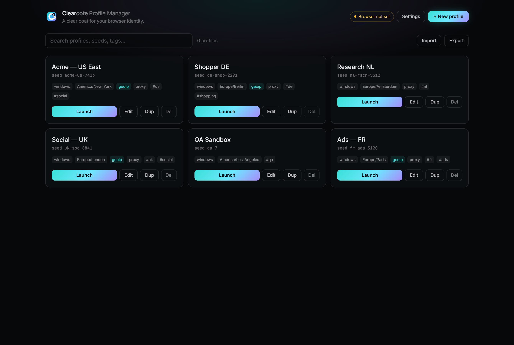
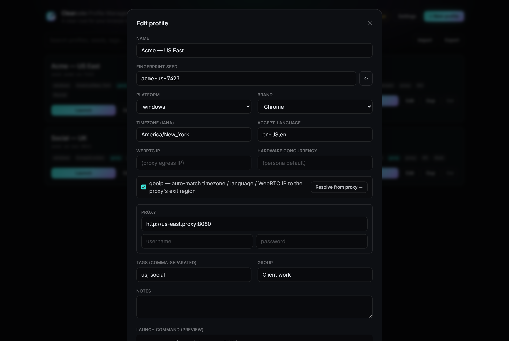

# Clearcote Profile Manager

A desktop app to **create, save, organize, and launch [Clearcote](https://github.com/clearcotelabs/clearcote-browser) browser profiles** — one coherent, persistent identity per profile (fingerprint seed + proxy + persistent storage), opened as a normal interactive browser window you drive yourself.



> **Status:** built — profile create/edit/launch, proxy geo-resolve, import/export, and a portable Windows build. Full design + phases in **[PLAN.md](PLAN.md)**.

<details>
<summary>Profile editor</summary>



</details>

## Why

Clearcote is driven by command-line identity flags (`--fingerprint`, `--fingerprint-platform`, `--timezone`, `--accept-lang`, `--webrtc-ip`, `--proxy-server`, `--user-data-dir`). Juggling many identities by hand is tedious and error-prone. This app gives you a GUI to:

- **Create & save profiles** — each a named identity: fingerprint seed, platform/brand, timezone, language, WebRTC IP, geoip auto-match, proxy, notes/tags.
- **Persist sessions** — every profile gets its own `--user-data-dir`, so cookies/logins/storage survive across launches.
- **Launch in one click** — spawns the verified Clearcote binary with the profile's flags as an interactive window.
- **Organize** — search, tag, group, duplicate, import/export.

It reuses the [clearcote npm SDK](https://www.npmjs.com/package/clearcote) only to **resolve + SHA-256-verify** the browser binary (auto-download). Launching is a direct, interactive `chrome.exe` spawn — **not** Playwright automation.

## Stack

Electron · Next.js (App Router) · React · TypeScript · Tailwind CSS · packaged with electron-builder (Windows-first, matching the browser).

## Quickstart (once implemented — see PLAN.md Phase 1)

```bash
npm install
npm run dev        # Electron shell + Next.js renderer
npm run dist       # build a Windows installer
```

## Layout

| Path | What |
|---|---|
| `electron/` | main process — profile storage, binary resolution, browser launch, IPC |
| `app/` | Next.js renderer (the UI) |
| `src/types/` | shared data model (`Profile`) |
| `profiles/` | runtime profile store — JSON per profile + per-profile `userdata/`; git-ignored except the example |

## Packaging (Windows)

```bash
npm run make-icon     # build/icon.ico from the brand mark (once)
npm run dist          # next export + electron compile + electron-builder NSIS installer → release/
```

This produces a signed-able NSIS installer in `release/`. A **portable build** (no installer) is also produced as `release/win-unpacked/` — zip it and run `Clearcote Profile Manager.exe` directly.

> **Note — NSIS installer on Windows:** electron-builder fetches `winCodeSign`, whose archive contains macOS symlinks. Extracting them needs symlink privilege, so on Windows **enable Developer Mode** (Settings → For developers) *or* run the build from an elevated shell once; otherwise `electron-builder` errors with *"Cannot create symbolic link"*. The portable `win-unpacked` build does not require this.

## License

BSD-3-Clause — matching the Clearcote project.
